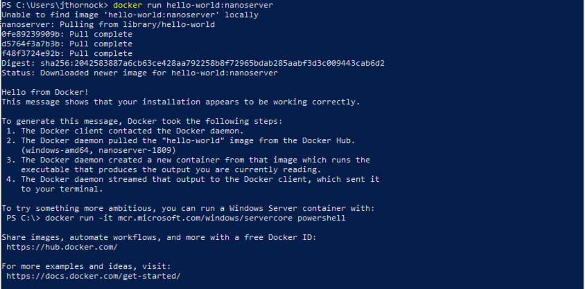

## Atlas Windows 2019 Server Standalone Installation

### Install Docker
1. Install Docker and Restart Server

```
Install-Module DockerMsftProvider -Force
Install-Package Docker -ProviderName DockerMsftProvider -Force
(Install-WindowsFeature Containers).RestartNeeded
Restart-Computer
```

2. Test Docker

```
docker run hello-world:nanoserver
```

 

### Create Location for Uploaded Files
ATLAS utilizes persistent storage to store any uploaded files. The files are stored on disk encrypted.
1. Create folder `C:\atlas\files` **OR**
2. If you are using another location, such as a mapped drive, make note of the location. We recommend the structure of `\atlas\files`.

### Setup Atlas Environment Variables File
1. Create folder `C:\atlas-install`
2. Copy the `atlas.env` file to `C:\atlas-install`
3. Update `atlas.env` with your JWT Token, Encryption Key, and Database Connection String
```
JWTSecretKey=<YourSuperSecretJWTSecretToken>
EncryptionKey=<YourSuperSecretEncryptionKey>
SQLConn=Server=tcp:<YourDatabaseURL>,1433;Initial Catalog=ATLAS;Persist Security Info=False;User ID=<YourDBUsername>;Password=<YourDBPassword;MultipleActiveResultSets=False;Encrypt=True;TrustServerCertificate=False;Connection Timeout=30;
```


### Setup HTTPS
If you want to run without https enabled, comment out the ASPNETCORE environment variables in the `atlas.env` file and skip the following steps

1. Create and copy your .pfx file to the `C:\https` folder

2. Update the `atlas.env` file with your cert name and password

```
ASPNETCORE_Kestrel__Certificates__Default__Password=<YourSuperSecretCertPassword>
ASPNETCORE_Kestrel__Certificates__Default__Path=C:\https\<YourCertName.pfx>
```

### Start Atlas
1. Start the Atlas container using the following Docker Run command
  - **NOTE** If you moved the location of `C:\atlas\files`, substitute that value in the `source` statement in the run command.

```
docker run -it --name atlas -p 443:443 --env-file atlas.env --mount type=bind,source="C:\atlas\files",target=C:\atlas\files --mount type=bind,source="C:\https",target=C:\https,readonly c2labs/atlas-c2internal:0.5.0-beta-win
```
